# Indonesia Poverty Profiling: ML Clustering & Anomaly Detection

## Executive Summary
Proyek ini menganalisis data sosio-ekonomi dari **514 Kabupaten/Kota di Indonesia** untuk memetakan profil kemiskinan secara granular. Menggunakan pendekatan *Machine Learning* (Clustering & Regression), analisis ini menantang asumsi umum bahwa kemiskinan hanya soal infrastruktur fisik.

**Key Discovery:**
Analisis membuktikan bahwa **Ketersediaan Lapangan Kerja Formal** adalah faktor penentu utama (Top Predictor) dalam menurunkan angka kemiskinan, memiliki dampak yang lebih signifikan dibandingkan variabel infrastruktur seperti akses air bersih atau sanitasi.

🔗 **Explore the Dashboard:** [[**Link Tableau**](https://public.tableau.com/views/IndonesiaPovertyProfilingMLClusteringAnomalyDetection/PovertyAnalysisDashboard?:language=en-US&:sid=&:redirect=auth&:display_count=n&:origin=viz_share_link)]

---

## 1. The Dataset & Preparation
Data ini mencakup indikator multidimensi: Kemiskinan, Pendidikan, Ketenagakerjaan, Pengeluaran Perkapita dan Fasilitas Perumahan.

**Data Dictionary:**
| Index/Feature | Tipe | Deskripsi |
| :--- | :--- | :--- |
| `Kabupaten/Kota` | Index/Feature | Asal Kabupaten/Kota data yang akan diolah |
| `Provinsi` | Index/Feature | Asal Provinsi Kabupaten/Kota |
| `Jumlah Penduduk Miskin (000)` | Index/Feature | Jumlah total penduduk miskin yang ada pada setiap Kabupaten/Kota |
| `Persentase Penduduk Miskin` | **Target (Y)** | Persentase penduduk di bawah garis kemiskinan. |
| `P1` | Index/Feature | Rata-rata kesenjangan pengeluaran setiap penduduk miskin |
| `P2` | Index/Feature | Ketimpangan pengeluaran antara penduduk miskin |
| `Garis Kemiskinan (Rp/kap/bulan)` | Index/Feature | Nominal pengeluaran penduduk untuk memenuhi kebutuhan pokok minimum. Jika pengeluaran dibawah dari standard yang ditetapkan, maka seseorang dianggap miskin |
| `Tamat Dibawah SD` | Index/Feature | Persentase penduduk miskin usia diatas 15 tahun keatas yang tamat dibawah **SD** |
| `Tamat SD/SMP` | Index/Feature | Persentase penduduk miskin usia diatas 15 tahun keatas yang tamat hanya **SD dan SMA** |
| `Tamat SMA dan Seterusnya` | Feature | Persentase penduduk miskin usia diatas 15 tahun keatas yang tamat diatas dari **SMA dan Seterusnya** |
| `Angka Partisipasi Sekolah 7-12` | Index/Feature | Persentase penduduk miskin berdasarkan golongan umur 7-12 tahun |
| `Angka Partisipasi Sekolah 13-15` | Index/Feature | Persentase penduduk miskin berdasarkan golongan umur 13-15 tahun |
| `Tidak Bekerja` | Index/Feature | Persentase penduduk miskin usia 15 tahun keatas yang tidak bekerja/menganggur atau sedang mencari pekerjaan dan bukan angkatan kerja(penduduk miskin yang tidak bekerja maupun tidak mencari pekerjaan) |
| `Bekerja di Sektor Informal` | Index/Feature | Persentase penduduk miskin usia 15 tahun keatas yang bekerja di sektor informal. Pekerjaan utamanya adalah berusaha sendiri, berusaha dibantu buruh tidak tetap/buruh tidak dibayar, pekerja bebas, atau pekerja keluarga/tidak dibayar |
| `Bekerja di Sektor Formal` | **Key Feature** | Persentase penduduk miskin usia 15 tahun keatas yang bekerja di sektor formal. Pekerjaan utamanya adalah bekerja dibantu buruh tetap/buruh dibayar atau buruh/karyawan/pegawai |
| `Bekerja di Sektor Pertanian` | Index/Feature | Persentase penduduk miskin usia 15 tahun keatas yang bekerja di sektor pertanian tanaman padi dan palawija, hortikultura, perkebunan, perikanan, peternakan, kehutanan, dan pertanian lainnya |
| `Bekerja di Sektor Bukan Pertanian` | Index/Feature | Persentase penduduk miskin usia 15 tahun keatas yang bekerja selain di sektor pertanian, seperti pertambangan dan penggalian, industri pengolahan, listrik dan gas, konstruksi/bangunan, perdagangan, hotel dan rumah makan, transportasi, keuangan, jasa atau lainnya |
| `Pengeluaran Per Kapita Untuk Makanan Miskin` | Index/Feature | Persentase penduduk miskin berdasarkan pengeluaran per kapita untuk makanan |
| `Pengeluaran Per Kapita Untuk Makanan Tidak Miskin` | Index/Feature | Persentase penduduk tidak miskin berdasarkan pengeluaran per kapita untuk makanan |
| `Pengeluaran Per Kapita Untuk Makanan Miskin dan Tidak Miskin` | Index/Feature | Rata-rata persentase penduduk miskin dan tidak miskin berdasarkan pengeluaran per kapita untuk makanan |
| `Air Layak` | Feature | Akses ke sumber air minum layak adalah jika sumber utama air yang digunakan untuk minum berasal dari air leding, sumur bor atau sumur pompa, sumur terlindung, mata air terlindung, dan air hujan. Termasuk juga ketika sumber air utama yang digunakan oleh rumah tangga berasal dari air kemasan bermerk atau air isi ulang, namun sumber air utama untuk mandi/cuci/dll. yang digunakan adalah leding, sumur bor atau sumur pompa, sumur terlindungi, mata air terlindung, dan air hujan. |
| `Jamban Sendiri/Bersama` | Feature | Akses ke fasilitas sanitasi rumah tangga yang menggunakan fasilitas tempat pembuangan air besar yang digunakan oleh rumah tangga sendiri atau bersama dengan rumah tangga tertentu. |

Data yang digunakan adalah **Data dan Informasi Kemiskinan Kabupaten Kota 2025** yang dikeluarkan oleh **Badan Pusat Statistik (BPS)**

**Cleaning Strategy (Context-Aware Imputation):**
Dataset memiliki *missing values*. Saya tidak menggunakan rata-rata nasional untuk mengisinya karena akan bias.
* **Solusi:** Menggunakan teknik `groupby('Provinsi').transform('mean')`.
* **Alasan:** Nilai kosong di kota Papua diisi dengan mean Papua, bukan mean Jakarta. Ini menjaga konteks regional tetap valid.

---

## 2. Methodology Pipeline

Pendekatan *End-to-End Data Science* yang dilakukan:

1.  **EDA (Exploratory Data Analysis):** Cek distribusi dan korelasi awal.
2.  **Unsupervised Learning (Segmentation):**
    * Algoritma: **K-Means Clustering**.
    * Teknik: **PCA (Principal Component Analysis)** untuk reduksi dimensi agar hasil klaster bisa divisualisasikan.
3.  **Supervised Learning (Prediction):**
    * Algoritma: **Random Forest Regressor**.
    * Tujuan: Memprediksi tingkat kemiskinan dan mengekstrak *Feature Importance*.
4.  **Evaluation & Anomaly Detection:** Mengukur performa model dan mencari kota yang menyimpang dari prediksi.

---

## 3. Visual Analysis & Deep Insights

Berikut adalah penjelasan detail dari visualisasi yang dihasilkan dalam analisis ini:

### A. Distribusi Kemiskinan (Histogram)
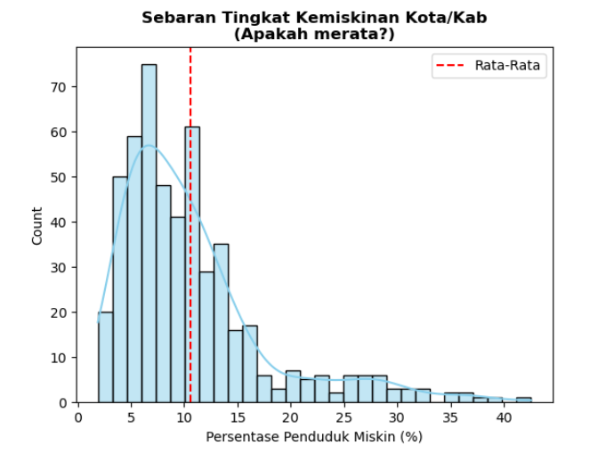
> *Visualisasi: Grafik batang histogram yang menunjukkan frekuensi tingkat kemiskinan.*

* **Observasi:** Grafik menunjukkan pola **Right-Skewed** (menceng ke kanan).
* **Insight:** Mayoritas kota di Indonesia memiliki tingkat kemiskinan moderat (5-15%). Namun, terdapat *long tail* di sisi kanan, yaitu sekelompok kota dengan kemiskinan ekstrem (>30%), mayoritas berada di wilayah Indonesia Timur. Rata-rata nasional menjadi bias karena adanya outlier ekstrem ini.

### B. Analisis Korelasi (Pendidikan vs Kemiskinan)
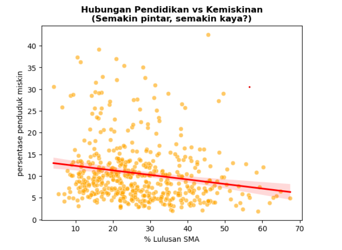
> *Visualisasi: Scatter Plot antara persentase '% Lulusan SMA' (Sumbu X) dan 'Persentase Penduduk Miskin' (Sumbu Y).*

* **Observasi:** Terdapat garis tren linier berwarna merah yang bergerak menurun dari kiri ke kanan (Negative Correlation). Meskipun trennya menurun, titik-titik data (wilayah) terlihat menyebar cukup lebar di sekitar garis merah dan tidak berkumpul terlalu rapat (variansi tinggi).
* **Insight:** Terdapat kecenderungan bahwa semakin tinggi persentase penduduk yang lulus SMA, semakin rendah tingkat kemiskinannya. Namun, karena sebaran datanya luas, ini menunjukkan bahwa pendidikan (sekadar lulus SMA) bukanlah satu-satunya faktor penentu kesejahteraan. Hubungannya ada, tetapi moderat; artinya masih banyak wilayah dengan tingkat pendidikan setara namun memiliki tingkat kemiskinan yang jauh berbeda.

### C. Analisis Korelasi (Sanitasi vs Kemiskinan)
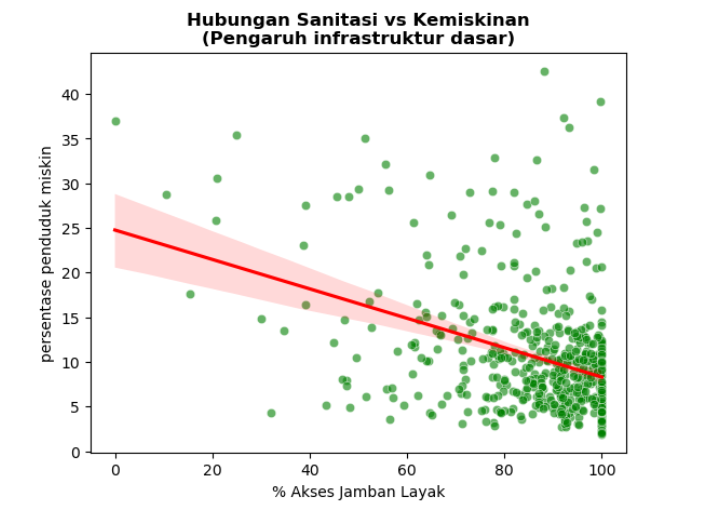
> *Visualisasi: Scatter Plot antara persentase '% Akses Jamban Layak' (Sumbu X) dan 'Persentase Penduduk Miskin' (Sumbu Y).*

* **Observasi:** Terlihat adanya garis tren menurun (garis merah), yang menunjukkan korelasi negatif. Sebagian besar titik data berkumpul di sisi kanan grafik (akses jamban tinggi >80%), namun sebarannya vertikalnya sangat lebar. Artinya, pada tingkat akses sanitasi yang sama (misalnya 90%), tingkat kemiskinan bisa sangat bervariasi mulai dari rendah hingga tinggi.
* **Insight:** Perbaikan infrastruktur dasar seperti akses sanitasi memiliki hubungan dengan penurunan tingkat kemiskinan, namun hubungannya tidak sekuat atau selinier yang diharapkan. Fakta bahwa masih ada titik-titik tinggi (kemiskinan tinggi) meskipun akses jambannya hampir 100% menunjukkan bahwa infrastruktur hanyalah prasyarat dasar. Memiliki fasilitas fisik yang baik tidak otomatis menjamin penduduknya kaya; faktor ekonomi lain masih bermain peran besar di sini.

### D. Analisis Korelasi (Pengangguran vs Kemiskinan)
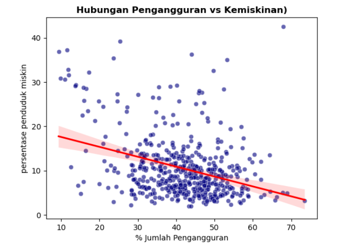
> *Visualisasi: Scatter Plot antara 'Persentase Jumlah Pengangguran' (Sumbu X) dan 'Persentase Penduduk Miskin' (Sumbu Y).*

* **Observasi:** Terdapat garis tren yang menurun (gradien negatif) dengan cukup jelas. Ini menunjukkan sebuah anomali atau hubungan terbalik: wilayah dengan persentase pengangguran terbuka yang lebih tinggi justru cenderung memiliki persentase penduduk miskin yang lebih rendah. Titik-titik data tersebar cukup luas, namun arah trennya konsisten menurun.
* **Insight:** Grafik ini menampilkan fenomena yang sering disebut sebagai **paradoks pengangguran** di negara berkembang. Penduduk yang sangat miskin seringkali "tidak mampu" untuk menganggur; mereka harus bekerja apa saja (serabutan/sektor informal) demi bertahan hidup, sehingga tidak tercatat sebagai pengangguran terbuka. Sebaliknya, pengangguran terbuka seringkali didominasi oleh kalangan menengah/perkotaan yang memiliki "tabungan" atau dukungan keluarga untuk menunggu pekerjaan formal yang sesuai, di mana tingkat kemiskinan di kelompok ini relatif lebih rendah.

### E. Uji Multikolinieritas 
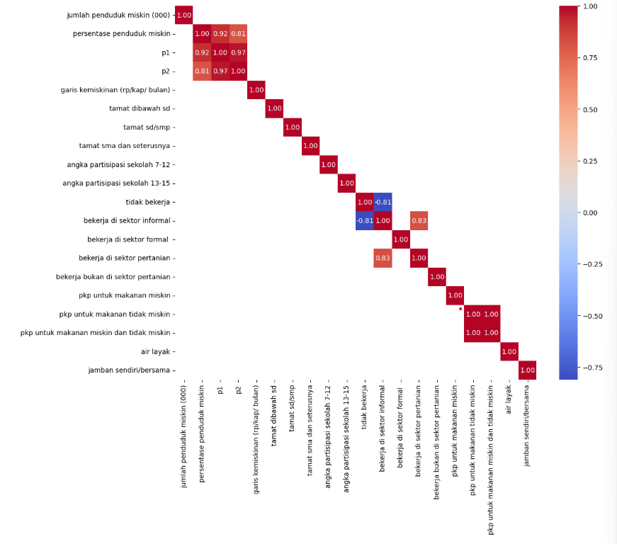
> *Visualisasi: Heatmap Correlation Matrix. Warna merah pekat menunjukkan korelasi positif yang sangat kuat (nilai mendekati 1.00), sedangkan warna biru menunjukkan korelasi negatif kuat.*

* **Observasi:** 
 **Klaster Merah (Pojok Kiri Atas & Kanan Bawah):** Terlihat kotak-kotak merah menyala dengan nilai korelasi sangat tinggi (0.92 - 1.00) pada kelompok variabel kemiskinan (persentase penduduk miskin, P1, P2) dan kelompok pengeluaran makanan (PKP).

 **Hubungan Sektor Pekerjaan:** Variabel 'Bekerja di sektor informal' memiliki korelasi positif kuat dengan 'Bekerja di sektor pertanian' (0.83), namun berkorelasi negatif kuat dengan 'Tidak bekerja' (-0.81).

* **Insight:** 
 **Data Redundan (Tumpang Tindih):** Variabel P0, P1, dan P2 mengukur hal yang hampir sama. Hal yang sama berlaku untuk variabel pengeluaran makanan. Oleh karena itu, dilakukan penggabungan variabel P0, P1, dan P2 menggunakan PCA untuk mengambil pola dari ketiga variabel itu dan menjadikannya variabel baru indeks kemiskinan gabungan.

 **Identitas Sektor:** Tingginya korelasi antara "Sektor Pertanian" dan "Sektor Informal" mengonfirmasi bahwa di wilayah studi ini, mayoritas pekerjaan pertanian bersifat informal.

 **Konfirmasi Paradoks Pengangguran:** Korelasi negatif (-0.81) antara "Tidak Bekerja" dan "Sektor Informal" menguatkan temuan di grafik D sebelumnya: Jika pengangguran turun, sektor informal naik (orang beralih ke kerja serabutan, bukan ke kerja formal).

### F. Menentukan Klaster Terbaik Menggunakan Silhouette Index 

> *Visualisasi: Line Chart yang menunjukkan nilai 'Silhouette Score' (Sumbu Y) terhadap jumlah 'Clusters' (Sumbu X) dari k=2 hingga k=5.*

* **Observasi:** Terlihat tren menurun yang sangat jelas. Nilai Silhouette Score tertinggi berada pada titik 2 Cluster (nilai di atas 0.62). Setelah itu, skor terus turun secara tajam saat jumlah cluster ditambah menjadi 3, 4, dan 5.
* **Insight:** Secara matematis, pembagian 2 kelompok merupakan opsi terbaik karena memiliki skor paling tinggi. Namun, pembagian 2 klaster untuk negara sebesar Indonesia sangat tidak variatif, sehingga dilanjut pengujian elbow method sebagai validasi pembagian jumlah klasternya.

### G. Validasi Penentuan Klaster Terbaik Menggunakan Elbow Method
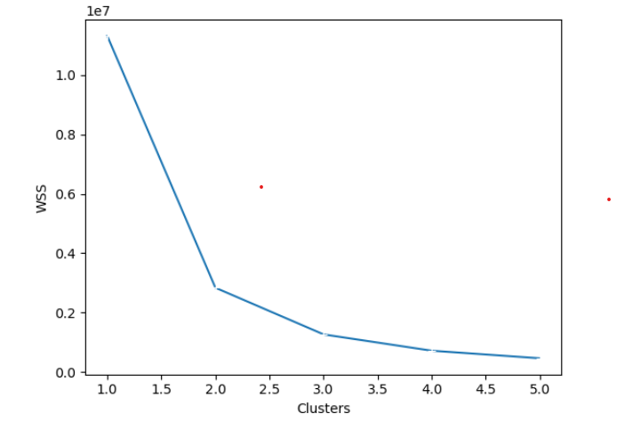
> *Visualisasi: Line Chart yang menunjukkan nilai WSS (Within-Cluster Sum of Squares) pada Sumbu Y terhadap jumlah 'Clusters' pada Sumbu X. Semakin rendah nilai WSS, semakin rapat data di dalam satu kelompok.*

* **Observasi:** Terjadi penurunan nilai WSS yang sangat drastis dan tajam saat jumlah cluster bergerak dari 1 ke 2. Setelah titik 2, penurunan garis mulai melandai (gradiennya mengecil), dan setelah titik 3, garis menjadi hampir datar. Titik di mana penurunan tajam berubah menjadi landai ini disebut "siku" (elbow).
* **Insight:** Konfirmasi Hasil Silhouette: Grafik ini sangat mendukung hasil analisis Silhouette Score sebelumnya. "Siku" yang paling tajam terbentuk di angka 2 Cluster. Ini berarti pemisahan data menjadi 2 kelompok memberikan penurunan variansi (error) terbesar. Namun pada lanjutannya, pembagian dibagi menjadi 3 klaster dengan tujuan melihat Kabupaten/Kota mana yang menjadi prioritas utama. 

### H. Cluster Segmentation (PCA Visualization)
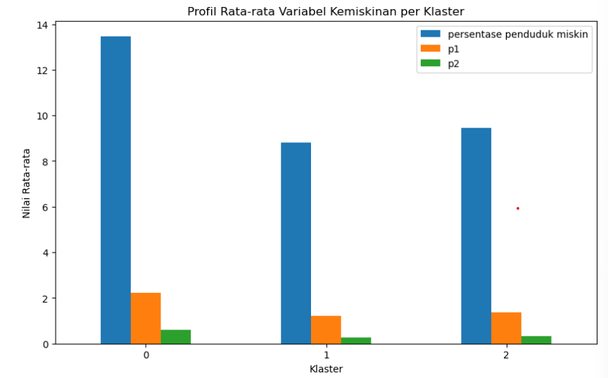
> *Visualisasi: Scatter Plot 2 Dimensi hasil PCA yang membagi titik menjadi 3 warna.*

Karena data memiliki banyak dimensi (Kemiskinan, Pendidikan, Ketenagakerjaan, Pengeluaran Per Kapita Untuk Makanan, dan Fasilitas Perumahan), saya menggunakan PCA untuk memvisualisasikannya dalam 2D. Hasilnya terbentuk 3 Klaster alami:
1.  **Cluster 0 (Kota Tertinggal):** Wilayah dengan defisit infrastruktur dasar dan pendidikan. (Target: Bantuan Fisik). 
2.  **Cluster 1 (Kota Maju):** Kota dengan sektor formal tinggi, pendidikan baik, sanitasi matang. (Target: Pemerataan/Inequality). 
3.  **Cluster 2 (Kota Berkembang):** Kota transisi, infrastruktur mulai baik tapi ekonomi masih bergantung sektor informal.

### I. Plotting Kota Tertinggal yang Disarankan Mendapat Perhatian Khusus 
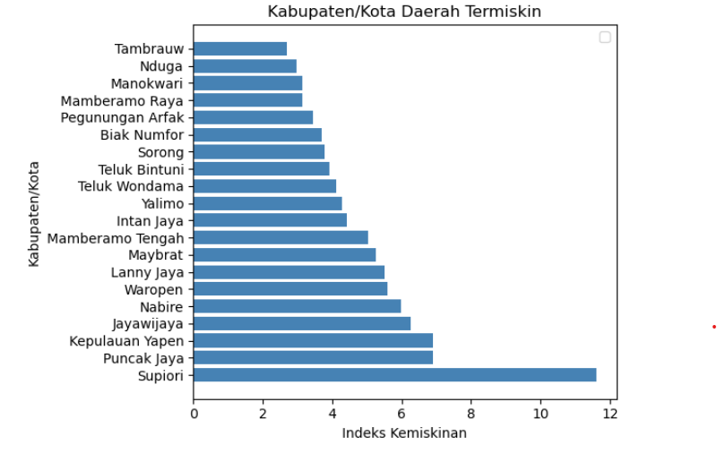
> *Visualisasi: Horizontal Bar Chart yang mengurutkan Kabupaten/Kota berdasarkan 'Indeks Kemiskinan' (Sumbu X). Semakin panjang batang (ke kanan), semakin tinggi nilai indeks kemiskinannya.*

* **Observasi:** 
 **Lonjakan Ekstrem di Supiori:** Kabupaten Supiori (batang paling bawah) memiliki nilai Indeks Kemiskinan yang sangat mencolok, mendekati angka 12. Nilai ini hampir dua kali lipat lebih tinggi dibandingkan wilayah di urutan kedua (Puncak Jaya, kisaran 7) dan ketiga (Kepulauan Yapen).
 
 **Sebaran Gradual**: Wilayah lain dari Tambrauw hingga Jayawijaya memiliki kenaikan nilai yang relatif bertahap (gradual) di kisaran angka 3 hingga 6. Tidak ada lompatan drastis selain pada Supiori.
 sup
* **Insight:** 
 **Prioritas Utama Intervensi:** Supiori merupakan outlier yang sangat jelas. Jika "Indeks Kemiskinan" ini menggambarkan tingkat keparahan (seperti Poverty Severity Index), maka kondisi kemiskinan di Supiori jauh lebih akut dibandingkan tetangganya dan memerlukan penanganan darurat atau strategi yang berbeda total dari wilayah lain. 

 **Pola Wilayah Pegunungan:** Kebanyakan provinsi yang tertinggal merupakan daerah pegunungan yang aksesnya sulit dijangkau. Ini menjadi tantangan dalam pembangunan infrastuktrur pada pola wilayah seperti ini. 

### J. Plotting Provinsi Berdasarkan Kota Tertinggal yang Disarankan Mendapat Perhatian Khusus 
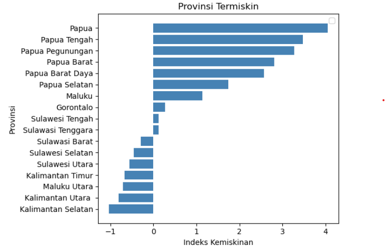
> *Visualisasi: Horizontal Bar Chart yang mengurutkan Provinsi berdasarkan 'Indeks Kemiskinan' (Sumbu X). Nilai positif (batang ke kanan) menunjukkan tingkat kemiskinan yang tinggi/parah, sedangkan nilai negatif (batang ke kiri) menunjukkan kondisi yang relatif lebih baik (tingkat kemiskinan di bawah rata-rata).*

* **Observasi:** 
 **Dominasi Total Wilayah Papua:** Lima peringkat teratas secara eksklusif diduduki oleh provinsi-provinsi di Pulau Papua (Papua, Papua Tengah, Papua Pegunungan, Papua Barat, dan Papua Barat Daya). Nilai indeks mereka sangat mencolok, berkisar antara 2.5 hingga 4.0.
 
 **Kontras Kalimantan & Sulawesi:** Di sisi bawah grafik, provinsi-provinsi di Kalimantan (seperti Kalimantan Selatan, Utara, Timur) dan sebagian Sulawesi (Utara, Selatan) memiliki nilai indeks negatif. Batang mereka mengarah ke kiri, menandakan tingkat kemiskinan mereka jauh lebih rendah dibandingkan kelompok Papua. 

* **Insight:** 
 **Ketimpangan Wilayah yang Akut:** Grafik ini mengonfirmasi bahwa kantong kemiskinan di wilayah studi ini sangat terpusat secara geografis. Wilayah Papua menghadapi tantangan struktural yang jauh lebih berat dibandingkan tetangganya di Sulawesi dan Kalimantan.
 
 **Pemekaran Belum Menjadi Solusi Instan:** Fakta bahwa provinsi hasil pemekaran (seperti Papua Tengah dan Papua Pegunungan) masih berada di urutan teratas menunjukkan bahwa perubahan administrasi wilayah belum serta-merta menghilangkan beban kemiskinan yang diwariskan. 

### K. Feature Importance (Random Forest Results)
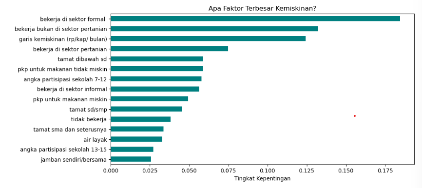
> *Visualisasi: Bar Chart yang mengurutkan faktor paling berpengaruh terhadap model.*

Ini adalah temuan terpenting proyek ini. Model Random Forest mengurutkan variabel berdasarkan kontribusinya dalam mengurangi *impurity* data.

* **Ranking 1: Bekerja di Sektor Formal (Score: ~0.180)** 🏆
* **Ranking 2:** Bekerja Bukan di Sektor Pertanian
* **Ranking 3:** Garis Kemiskinan 

**Critical Insight:**
Ternyata, **Struktur Ekonomi (Pekerjaan Formal)** lebih krusial daripada Infrastruktur Fisik. Membangun toilet (Sanitasi) itu penting, tapi menciptakan lapangan kerja formal (Pabrik/Industri/Jasa) memberikan dampak *leverage* yang jauh lebih besar untuk menurunkan angka kemiskinan secara signifikan.

### L. Anomaly Detection (Actual vs Predicted)
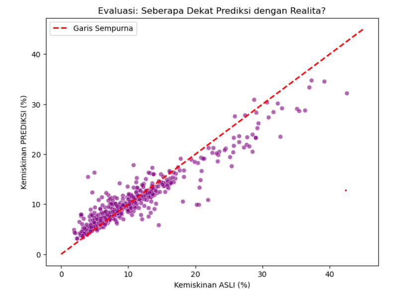
> *Visualisasi: Scatter Plot membandingkan Data Asli vs Prediksi Model.*

* **Garis Merah:** Kondisi ideal (Prediksi = Realita).
* **Titik Jauh di Bawah Garis (Underperformers):**
    * Contoh: Beberapa kota di Indonesia Bagian Timur atau daerah kaya SDA.
    * **Insight:** Kota-kota ini memiliki data yang beragam, bahkan tidak semua berada pada keadaan miskin. Dari data tersebut model memprediksi kemiskinannya rendah, namun realitanya kota-kota tersebut memiliki kemiskinan yang lebih tinggi dari yang diprediksi.
    * **Penyebab:** Kemungkinan adanya ketimpangan distribusi kekayaan yang ekstrem atau inefisiensi dalam program pengurangan kemiskinan.

---

## 4. Policy Recommendations

Berdasarkan data, berikut rekomendasi untuk pemangku kebijakan:

1.  **Shift Focus to Formalization:**
    Program pengentasan kemiskinan tidak boleh hanya berfokus pada bantuan sosial (Bansos). Prioritas harus digeser ke insentif bagi UMKM untuk menjadi formal, karena sektor formal adalah "obat paling ampuh" melawan kemiskinan.
2.  **Asymmetric Regional Intervention (Papua Special Focus):** 
    Dasar Data dari 5 Provinsi termiskin didominasi total oleh wilayah Papua. Tindakan Kebijakan "Satu Ukuran untuk Semua" tidak akan berhasil. Diperlukan Afirmasi Khusus untuk wilayah Papua yang fokus pada pemecahan isolasi logistik dan stabilitas keamanan, karena pendekatan ekonomi biasa tidak berjalan efektif di sana dibandingkan wilayah Sulawesi/Kalimantan.
3.  **Targeted Cluster Strategy:**
    * Untuk **Cluster Tertinggal**, fokuskan anggaran pada pembangunan fisik dasar (Air & Sekolah Dasar). Fokus intervensi murni pada Infrastruktur Dasar (Sanitasi/Air Bersih) dan Bantuan Langsung Tunai (BLT) bersyarat, karena infrastruktur adalah prasyarat mutlak sebelum bicara ekonomi.
    * Untuk **Cluster Berkembang**, fokuskan pada pelatihan vokasi dan kredit usaha untuk mendorong formalisasi ekonomi. Hentikan bantuan fisik, ganti dengan Pelatihan Vokasi & Akses Kredit. Di sini infrastruktur sudah ada, tapi skill gap (pendidikan) menjadi penghambat kesejahteraan.
4. **"Red-Flag" Audit Task Force (Kasus Supiori):**
    Kabupaten Supiori memiliki nilai ekstrem (outlier) yang hampir 2x lipat lebih buruk dari peringkat kedua Diperlukan tindakan Membentuk Satgas Khusus untuk Supiori dan audit mendalam apakah ini masalah kegagalan panen, bencana alam, atau kebocoran anggaran yang parah, karena anomali setinggi ini mengindikasikan kegagalan sistemik lokal.
5.  **Audit Anomali:**
    Lakukan audit khusus ke kota-kota yang terdeteksi sebagai *Underperformers* dalam model ini, karena ada indikasi masalah struktural yang tidak terdeteksi oleh statistik biasa.

---
## 5. Preview Dashboard Tableau
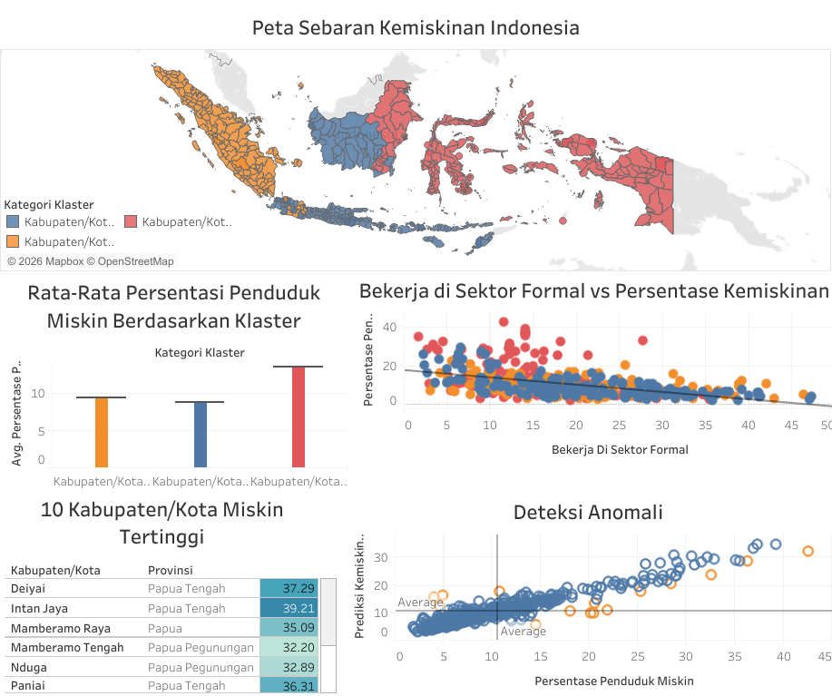
---

## Tech Stack
* **Python:** Data Cleaning, Statistical Analysis.
* **Pandas & NumPy:** Data Manipulation.
* **Scikit-Learn:** K-Means Clustering, PCA, Random Forest Regression.
* **Matplotlib & Seaborn:** Static Visualization.
* **Tableau:** Interactive Dashboarding.

---

## Author
**Muhammad Rizkiyanto**
* [LinkedIn](https://www.linkedin.com/in/muhammad-rizkiyanto/)
* [Medium](https://medium.com/@aarizkiyans)
* [Article](https://medium.com/@aarizkiyans/its-not-just-about-sanitation-uncovering-the-real-roots-of-poverty-in-indonesia-with-data-science-60870ca1d30e)
* [Github](https://github.com/aarizkiyans/)